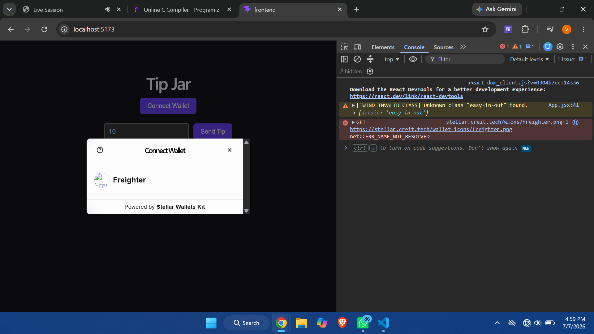
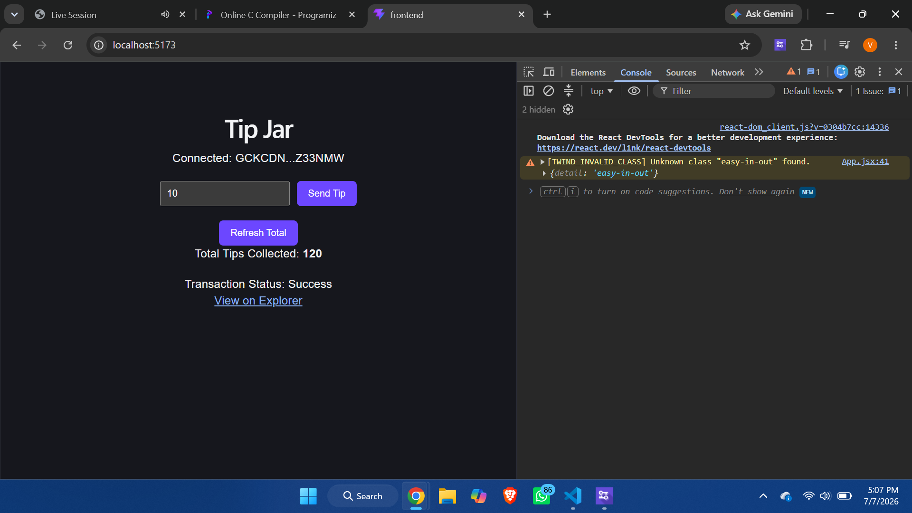
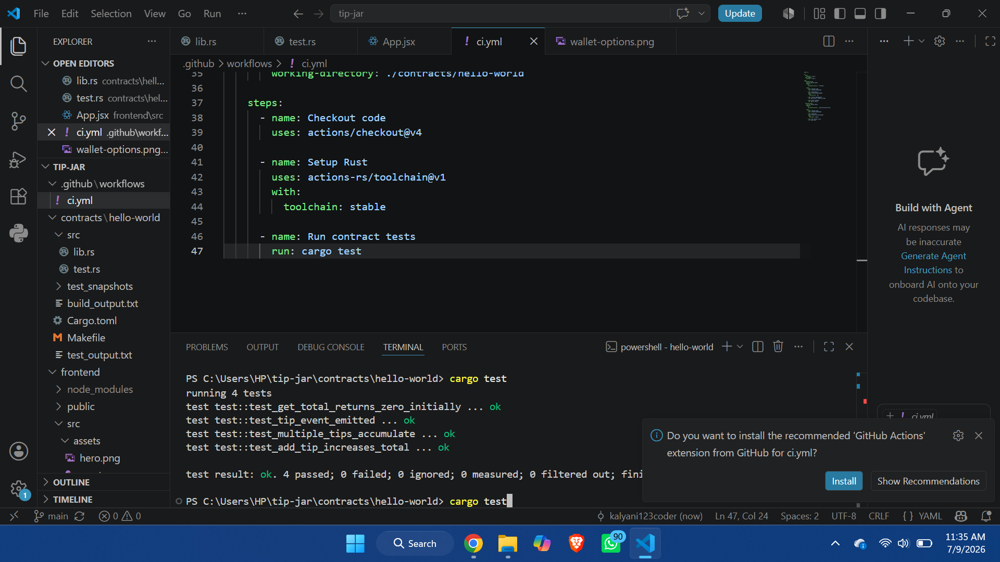
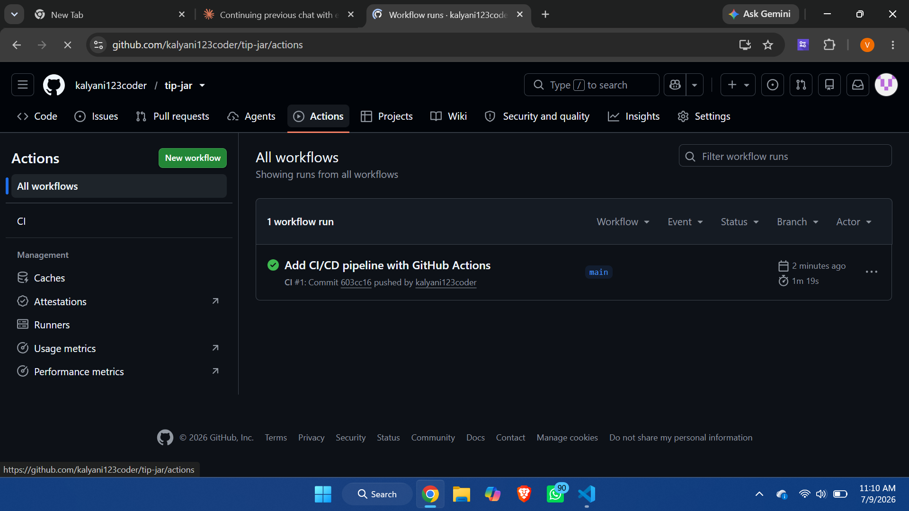
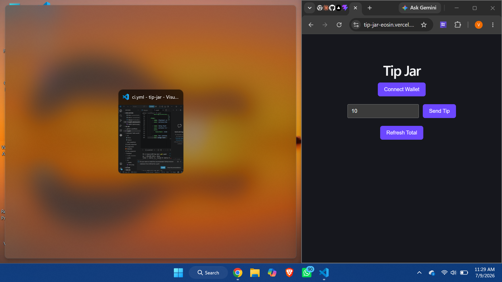

# 💸 Tip Jar - Stellar Soroban DApp

A production-ready decentralized Tip Jar application built on the Stellar network using Soroban smart contracts. Users can connect their wallet, send tips, and see the total tips collected update in real time. Includes automated testing, CI/CD, and a live deployment.

**Live Demo:** https://tip-jar-eosin.vercel.app
**Demo Video:** https://youtu.be/rya-krsnDMc

## Features

- Multi-wallet support via StellarWalletsKit (Freighter)
- Smart contract deployed on Stellar Testnet
- Event emission on every tip (for real-time updates)
- Live transaction status tracking (pending to success/fail)
- Real-time total tips display after each transaction
- Error handling for: wallet not found, transaction rejected, insufficient balance
- Automated contract tests (4 passing tests)
- CI/CD pipeline via GitHub Actions (build + test on every push)
- Mobile responsive layout
- Live production deployment on Vercel

## Tech Stack

- Smart Contract: Rust + Soroban SDK
- Frontend: React (Vite)
- Wallet Integration: @creit.tech/stellar-wallets-kit
- Blockchain SDK: @stellar/stellar-sdk
- CI/CD: GitHub Actions
- Hosting: Vercel

## Contract Details

- Contract ID: CBT2CTMB47ADYTTJCBISXCRDCALTP75T6NP7YCQQXTONY6V5GB6JVV3P
- Network: Stellar Testnet
- Explorer: https://stellar.expert/explorer/testnet/contract/CBT2CTMB47ADYTTJCBISXCRDCALTP75T6NP7YCQQXTONY6V5GB6JVV3P

## Sample Transaction

- Transaction Hash: 74c0cdc2d0444b4a320957cc242410dae4d8cebc69fe749a03b53995dc3a1a1a
- Explorer Link: https://stellar.expert/explorer/testnet/tx/74c0cdc2d0444b4a320957cc242410dae4d8cebc69fe749a03b53995dc3a1a1a

## Screenshots

### Wallet Connection Options

### Successful Tip Transaction (Live)

### Contract Test Output (4/4 Passing)

### CI/CD Pipeline (GitHub Actions)

### Mobile Responsive UI

## Setup Instructions

### Prerequisites
- Node.js (v18+)
- Rust + Soroban CLI
- Freighter Wallet browser extension

### 1. Clone the repository
git clone https://github.com/kalyani123coder/tip-jar.git
cd tip-jar

### 2. Run the frontend
cd frontend
npm install
npm run dev

The app will be available at http://localhost:5173

### 3. Run contract tests
cd contracts/hello-world
cargo test

### 4. Rebuild and redeploy the contract (optional)
cd contracts/hello-world
stellar contract build
stellar contract deploy --wasm ../../target/wasm32v1-none/release/hello_world.wasm --source alice --network testnet

## CI/CD Pipeline

This project uses GitHub Actions (.github/workflows/ci.yml) to automatically:
- Install frontend dependencies and build the React app
- Run the Rust/Soroban contract test suite

The pipeline runs on every push and pull request to the main branch.

## Project Structure

tip-jar/
- .github/workflows/ci.yml - CI/CD pipeline
- contracts/hello-world/src/lib.rs - Smart contract logic + event emission
- contracts/hello-world/src/test.rs - Contract unit tests
- frontend/src/App.jsx - Main React app (wallet + contract integration)
- screenshots/ - Submission screenshots
- README.md

## How It Works

1. User clicks Connect Wallet, StellarWalletsKit opens a modal to select a wallet (Freighter)
2. User approves the connection in their wallet
3. User enters a tip amount and clicks Send Tip
4. The transaction is built, signed via the wallet, and submitted to the network
5. The contract adds the tip to storage and emits a tip_added event
6. Transaction status updates live: Pending to Success/Failed
7. Total tips collected is refreshed automatically after a successful transaction

## Testing

The smart contract includes 4 automated tests covering:
- Adding a tip increases the total
- Total starts at zero
- Multiple tips accumulate correctly
- Tip events are emitted correctly

Run with: cargo test inside contracts/hello-world

## Author

Built as part of the Stellar Developer Bootcamp - Level 3 submission (Advanced Smart Contracts + Production-Ready dApps).